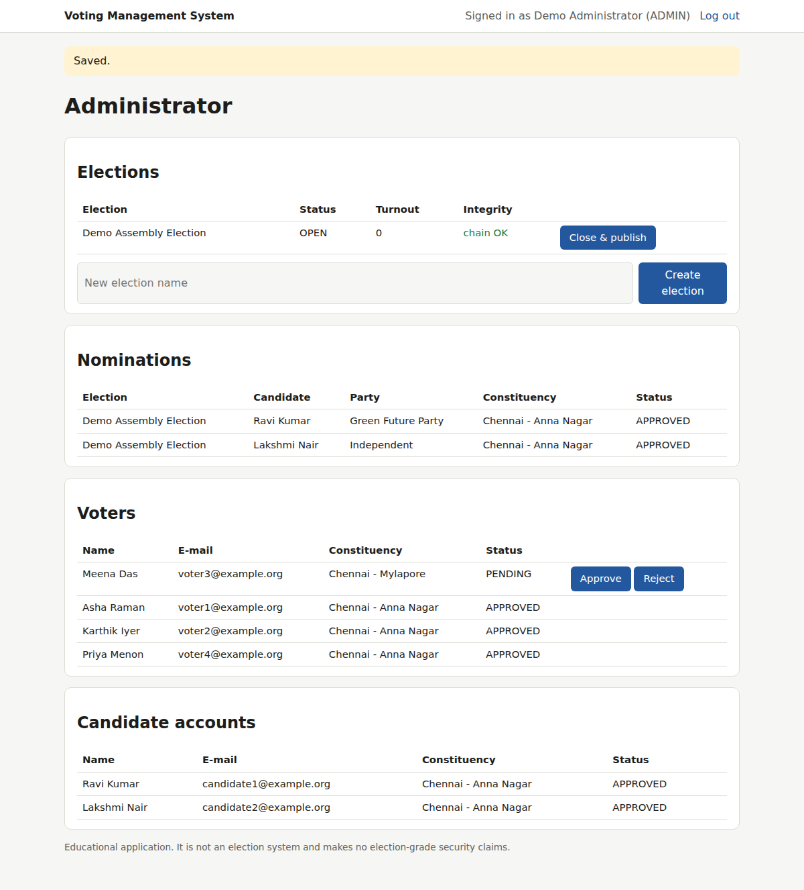
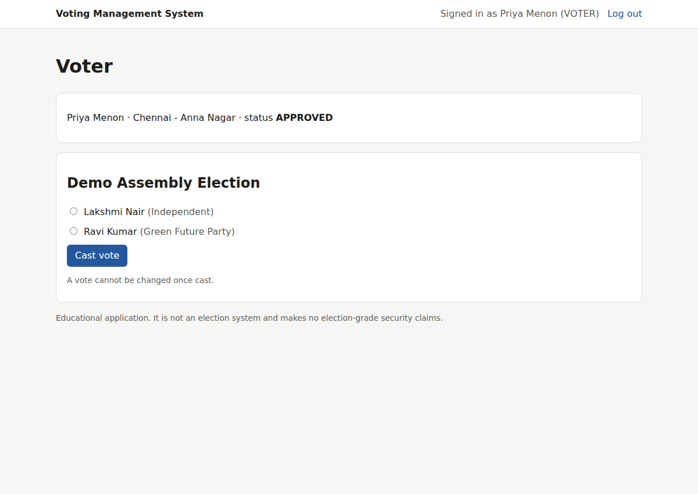
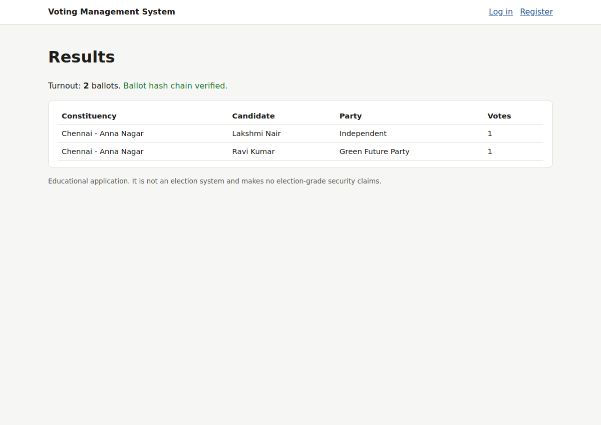

# Voting Management System (educational)

[](https://github.com/Aakashnaidum/voting-management-system/actions/workflows/ci.yml)

A Java Servlet/JSP web application for running a small, constituency-based election. Voters and
candidates register, an election administrator approves accounts and nominations, and each approved voter casts
**exactly one** ballot. Results are published when the election closes, together with an integrity check
of the stored ballots.

> **Educational project.** It is not an election system, has not been security-audited, and makes no
> election-grade or blockchain guarantees. See [Limitations](#limitations).



## Origin and what changed

The starting point was a third-party academic project package: JSP/Servlets on Tomcat 9 with MySQL. It also included a local
Ganache (Ethereum) node, IPFS uploads via Filebase, Face++ face matching and Gmail OTP e-mails. I did not write that
original code, and it is **not** included here. A review found serious problems. Among them: no passwords for voters or candidates,
a hard-coded `admin/admin` login, SQL injection, third-party API keys and a private key in the source, and no database-level protection against double voting. Voter e-mails were also stored in, and uploaded publicly alongside, each ballot.
The full list with file references is in [`docs/SECURITY_REVIEW.md`](docs/SECURITY_REVIEW.md).

This repository is a **rebuild** that keeps the original's purpose, roles and workflow but uses a new code base:

| Area | Now |
|---|---|
| Authentication | E-mail + password. PBKDF2-HMAC-SHA256 (210k iterations, random salt), constant-time comparison, session renewed at login |
| Authorisation | A `SecurityFilter` restricts `/admin`, `/voter` and `/candidate` to their roles. Account status is re-read from the database on every request |
| Input/output | Only parameterised SQL, server-side validation, JSTL output escaping, per-session CSRF tokens, security headers |
| One person, one vote | `participation(election_id, voter_user_id)` primary key, inserted in the same transaction as the ballot, with the election row locked (`SELECT … FOR UPDATE`) |
| Ballot secrecy (basic) | Ballots carry no voter reference. "Who voted" and "what was voted" are stored in separate tables |
| Integrity | Per-election SHA-256 hash chain over ballots, verified on the admin dashboard and results page. Detects edits, deletions and ballot/participation mismatches |
| Configuration | No secrets in code. The database and first admin come from environment variables (`.env.example`) |
| Data | Clean schema ([`schema.sql`](src/main/resources/db/schema.sql)) and synthetic demo data only |
| Removed | Face++, Gmail OTP, IPFS/Filebase and Ganache. They depended on leaked credentials and external services (see the security review) |

## Workflow

1. **Voter / candidate** registers with a constituency and starts as `PENDING`.
2. **Administrator** approves or rejects accounts, creates an election (`DRAFT`) and opens it (`OPEN`).
3. **Candidate** (approved) files a nomination for an election in their own constituency. The administrator approves or rejects it.
4. **Voter** (approved) sees the approved candidates in their constituency and casts one ballot. A second attempt, including a
   replayed or crafted POST, is rejected.
5. **Administrator** closes the election (`CLOSED`, which cannot be reopened). The per-constituency results and the integrity check are then public.

| Voter ballot | Published results |
|---|---|
|  |  |

## Architecture

```
src/main/java/io/github/aakashnaidum/voting/
  config/AppConfig          environment/system-property configuration
  db/Database               JDBC connections, schema loader
  security/                 PasswordHasher, SecurityFilter (roles + CSRF + headers), SessionUser
  service/                  UserService, ElectionService, VotingService (business rules, transactions)
  web/                      servlets (Auth, Admin, Voter, Candidate, Results), AppContext listener, DemoData
src/main/webapp/WEB-INF/jsp views (JSTL)
src/main/resources/db/      schema.sql (MySQL 8 / H2), demo-data.sql (synthetic)
src/test/java/              JUnit 5 tests
```

## Run it

Requirements: JDK 11+ and Maven 3.8+.

**Demo (in-memory H2, synthetic accounts):**

```bash
mvn jetty:run          # http://localhost:8080  (sets voting.demo=true)
```

Demo accounts use the password `demo-password-2026`: `admin@example.org`, `voter1@example.org`,
`voter2@example.org`, `voter3@example.org` (pending), `candidate1@example.org` and `candidate2@example.org`. All names and
addresses are invented.

**MySQL + Tomcat 9:**

```bash
mysql -u root -p -e "CREATE DATABASE voting; CREATE USER 'voting_app'@'localhost' IDENTIFIED BY '...';
                     GRANT SELECT, INSERT, UPDATE ON voting.* TO 'voting_app'@'localhost';"
mysql -u root -p voting < src/main/resources/db/schema.sql
mysql -u root -p voting < src/main/resources/db/demo-data.sql     # optional reference data
mvn package                                                      # target/voting.war
# set VOTING_DB_URL / VOTING_DB_USER / VOTING_DB_PASSWORD / VOTING_ADMIN_EMAIL / VOTING_ADMIN_PASSWORD
# (e.g. in $CATALINA_BASE/bin/setenv.sh), then deploy target/voting.war
```

The application user needs no `DELETE`/`DROP` rights. Serve it over HTTPS in any shared setting.

## Tests

`mvn test` runs 21 JUnit tests against an in-memory H2 database:

- **Passwords:** salted hashes, verification, malformed hashes.
- **Accounts:** registration stores only a hash and starts `PENDING`; login needs the correct password; SQL-injection
  payloads fail; validation; duplicate e-mails; admins cannot be modified via status changes.
- **Voting rules:** one vote per voter; no partial ballot after a rejected second vote; pending voters and non-voters are
  blocked; out-of-constituency and unapproved candidates are blocked; voting only while `OPEN`, with no reopening;
  correct tallies; ballots have no voter column; tampering (edit or delete) is detected; **16 concurrent vote attempts produce exactly one ballot**; duplicate nominations are rejected.
- **Security filter:** anonymous users are redirected, a wrong role gets 403, a POST without a valid CSRF token gets 403, and security headers are set.

CI (GitHub Actions) runs `mvn verify` and loads the schema into MySQL 8.

## Limitations

- No independent audit or penetration test. It is not suitable for real elections.
- A database administrator could still link `participation` and `ballots` by insertion order. Real secret ballots
  need cryptographic protocols.
- The hash chain is tamper-*evident* against edits to stored rows. It cannot stop an insider who rewrites the entire chain
  unless the chain head is published externally.
- There is no login rate limiting, account lockout, e-mail verification or password reset.

## Contributions

Original base: third-party academic project package (not included). Rebuild, security review, tests and documentation:
Aakash Naidu, prepared with AI assistance (Claude). No open-source license is granted, because the
redistribution rights for the original base could not be established.
